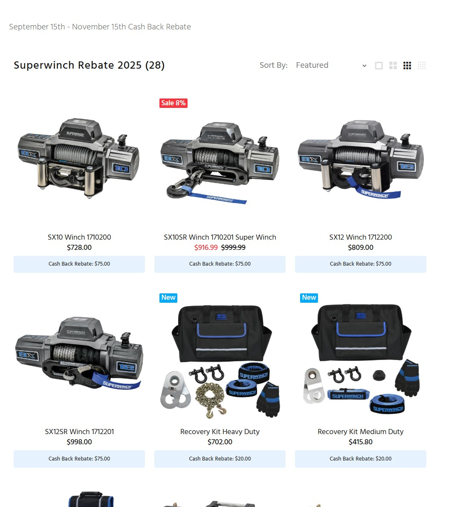
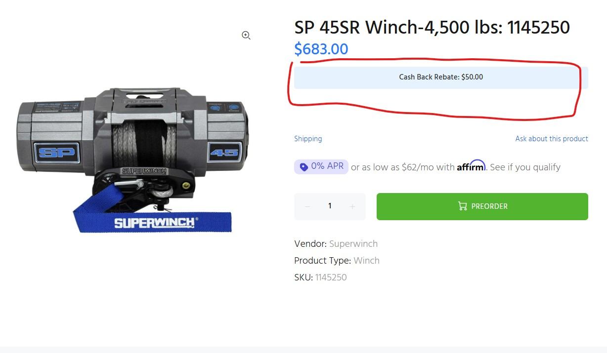
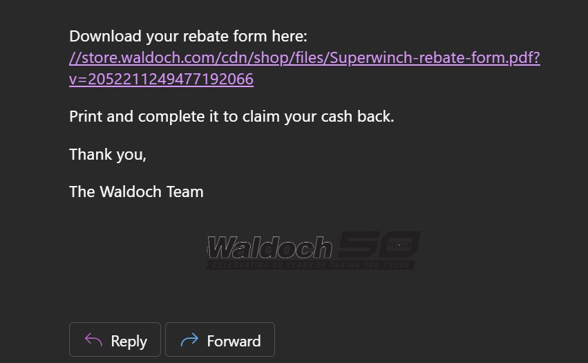

# Superwinch Rebate Popup & Dynamic Pricing (Shopify Integration)

This project adds a **rebate marketing system** to your Shopify store.  
It includes:

- A **popup modal** that appears during an active rebate period.
- A **carousel of qualifying products** pulled from a dedicated collection.
- **Dynamic rebate pricing** displayed on product and collection pages.
- **Rebate form delivery options**:
  - Download PDF
  - Print PDF
  - Email form link via backend API (SendGrid + Shopify customer creation/update)

---

# Table of Contents

- [Superwinch Rebate Popup & Dynamic Pricing (Shopify Integration)](#superwinch-rebate-popup--dynamic-pricing-shopify-integration)
  - [Features](#features)
    - [Popup Modal](#popup-modal)
    - [Dynamic Rebate Pricing](#dynamic-rebate-pricing)
    - [Email Backend](#email-backend)
    - [Date Logic](#date-logic)
  - [Prerequisites](#prerequisites)
  - [Frontend Setup](#frontend-setup)
    - [Step 1: Libraries](#step-1-libraries)
    - [Step 2: Popup Snippet](#step-2-popup-snippet)
    - [Step 3: Dynamic Price Display](#step-3-dynamic-price-display)
  - [Backend Setup (Render Deployment)](#backend-setup-render-deployment)
    - [Dependencies](#dependencies)
    - [Deploy Express Server](#deploy-express-server)
    - [Environment Variables (.env)](#environment-variables-env)
    - [Render Setup](#render-setup)
  - [Testing](#testing)
    - [Optional Enhancements](#optional-enhancements)
    - [Notes](#notes)

## Features

### Popup Modal
- Triggers automatically when the rebate period is active.
- Displays products from the `superwinch-rebate-2025` collection.
- Provides download, print, and email options for the rebate form.


### Dynamic Rebate Pricing
- Collection and product pages show cash back amount.






### Email Backend
- Built with Node.js + Express.
- Uses SendGrid’s Web API (via `@sendgrid/mail`) for secure emailing
- Integrates with Shopify Admin API:
  - Creates new customer with `rebate` tag.
  - If customer already exists, updates their tags instead of failing.

  

### Date Logic
- Popup and rebate display are only active between:
  - **Start**: September 15, 2025
  - **End**: November 15, 2025

---

## Prerequisites

- Shopify admin access.
- Duplicate theme for safe testing (`Online Store > Themes > Actions > Duplicate`).
- Rebate form PDF uploaded in **Content > Files** (`rebate-form.pdf`).
- Collection named **superwinch-rebate-2025** with qualifying products.
- SendGrid account with a verified sender identity (e.g., `noreply@example.com`) and an API key with **Mail Send** permissions.
- Private Shopify app (Admin API access token with **read/write customers** scope).

---

## Frontend Setup

### Step 1: Libraries
- Upload `slick.min.js` and `slick.css` to **Assets**.
- Add includes in `theme.liquid`:
  ```html
  <link href="{{ 'slick.css' | asset_url }}" rel="stylesheet">
  <script src="https://code.jquery.com/jquery-3.6.0.min.js"></script>
  <script src="{{ 'slick.min.js' | asset_url }}"></script>
  ```

### Step 2: Popup Snippet
- Add `snippets/rebate-popup.liquid`.
- Include product carousel + buttons for Download, Print, Email.
- Insert snippet before `</body>` in `theme.liquid`.

### Step 3: Dynamic Price Display
- Update `product-card` and `product-template` snippets:
  ```liquid
  
    <p class="rebate-price">
      After Rebate: {{ product.price | money_without_trailing_zeros | minus: rebate_amount }}
    </p>
  
  ```

---

## Backend Setup (Render Deployment)

### Dependencies
- Ensure the following Node.js dependencies are included in your `package.json`:
  ```json
  {
    "dependencies": {
      "@sendgrid/mail": "^8.1.6",
      "cors": "^2.8.5",
      "dotenv": "^17.2.2",
      "express": "^5.1.0",
      "node-fetch": "^3.3.2"
    }
  }
- Run `npm install` to install these dependencies in your backend project.

### Deploy Express Server
- Code lives in `/backend` (Node 18+).
- Example route:
  ```js
  app.post("/api/send-rebate", async (req, res) => {
    // Send email via SendGrid
    // Check if Shopify customer exists, update or create
    res.json({ emailSent: true, shopifySuccess: true });
  });
  ```

### Environment Variables (.env)
```env
PORT=10000
SENDGRID_API_KEY=your-sendgrid-api-key
EMAIL_FROM=noreply@example.com
SHOPIFY_SHOP=your-shop-name.myshopify.com
SHOPIFY_ACCESS_TOKEN=shpat_xxxxxxxxx
```

### Render Setup
- Create new Web Service.
- Add environment variables above.
- Use `npm start` as start command.

---

## Testing

- Load preview theme → popup should display.
- Click Download → PDF should open.
- Click Print → print dialog should appear.
- Click Email:
  - Email should arrive from `noreply@example.com`.
  - Customer should be created/updated in Shopify with tag `rebate`.

---

## Optional Enhancements

- **Cookie-based frequency control**: Only show popup once per session using `js-cookie`.

---

## Notes

- Always test in a duplicate theme before publishing live.
- Ensure your sender email (noreply@example.com) is verified in SendGrid and that your API key has Mail Send permissions.
- If using Klaviyo/Shopify Flow, you can enhance follow-up automations for tagged customers.